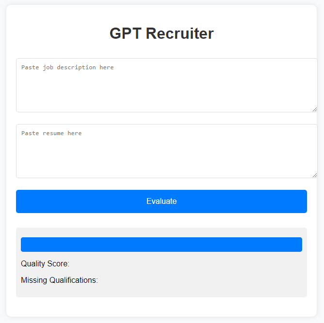

# GPT Recruiter

## What is GPT Recruiter

## Getting Started
* Clone the repo and create a file in the main folder called .env which contains your API key in this format:  
OPENAI_API_KEY=sk-... your OpenAI API Key

To run, simply type "python3 app.py" and navigate to http://127.0.0.1:5000

